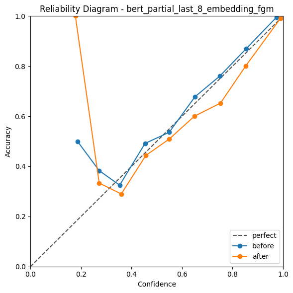

# 中文电商评论十分类实验结果对比

本项目使用 `online_shopping_10_cats` 中文电商评论数据集进行十分类实验，比较 `TF-IDF + Logistic Regression`、`LSTM` 和 `BERT`。BERT 部分进一步比较了 frozen、partial fine-tuning、额外解冻 embedding、FGM 对抗训练、full fine-tuning 以及温度校准后的置信度表现。

当前数据集使用原始 CSV 中的 `review` 作为文本，`cat` 作为十分类标签，原始 `label` 情感列不参与本任务。数据划分如下：

| Split | 样本数 |
| --- | ---: |
| train | 43,941 |
| val | 9,416 |
| test | 9,416 |

类别包括：`书籍`、`平板`、`手机`、`水果`、`洗发水`、`热水器`、`蒙牛`、`衣服`、`计算机`、`酒店`。

完整运行说明见 `docs/OPERATION.md`，项目结构说明见 `docs/PROJECT_STRUCTURE.md`。

## 1. 不同模型结果对比

这里按验证集选择模型，再在测试集上汇报最终结果。BERT 主结果采用 `bert_partial_last_8_embedding_fgm`，这是当前验证集 Macro F1 最高的一组；若只看本次测试集 Macro F1，`bert_partial_last_4_embedding_fgm` 略高。

| 模型 | 实验目录 | Test Accuracy | Test Macro F1 | Test Loss | Best Val Macro F1 | 说明 |
| --- | --- | ---: | ---: | ---: | ---: | --- |
| TF-IDF + LR | `lr_tfidf` | 0.8910 | 0.8777 | - | 0.8878 | 传统机器学习 baseline，速度快但上限较低 |
| LSTM | `lstm` | 0.9024 | 0.8942 | 0.5768 | 0.8964 | 字符级双向 LSTM，明显优于 TF-IDF |
| BERT | `bert_partial_last_8_embedding_fgm` | 0.9174 | 0.9155 | 0.2430 | 0.9175 | 验证集最优，使用 partial last 8 + embedding + FGM |

从结果看：

- `TF-IDF + LR` 作为 baseline 已经达到 `0.8777` Macro F1，说明电商评论中的品类词仍有较强区分度。
- `LSTM` 使用字符级输入、双向结构和类别权重后，Macro F1 提升到 `0.8942`，比 TF-IDF 更能处理口语化、短文本和局部上下文。
- `BERT` 取得当前最优的验证集表现，测试 Macro F1 为 `0.9155`，相较 LSTM 继续提升约 `0.0213`。

相关图表：

- `outputs/comparison/model_test_scores.png`
- `outputs/comparison/model_metric_heatmap.png`
- `outputs/comparison/model_generalization_gap.png`

## 2. 主要实验参数

每个实验的完整参数均保存在 `configs/<experiment>/config.json`。下表列出关键设置。

| 模型 | 关键参数 |
| --- | --- |
| TF-IDF + LR | `max_features=50000`，`ngram_range=(1,2)`，`min_df=2`，`max_df=0.95`，`sublinear_tf=True`，`C=12`，`max_iter=3000` |
| LSTM | `tokenizer=char`，`embed_dim=256`，`hidden_size=384`，`num_layers=2`，`bidirectional=True`，`pooling=last_mean`，`dropout=0.4`，`max_len=256`，`batch_size=64`，`lr=8e-4` |
| BERT | `bert-base-chinese`，`max_len=256`，`batch_size=16`，`epochs=6`，`dropout=0.2`，`bert_lr=2e-5`，`classifier_lr=2e-4`，`weight_decay=0.01` |
| 类别不均衡处理 | LSTM 和 BERT 均使用类别权重，`class_weight_power=0.5` |
| 正则化 | LSTM 使用 `label_smoothing=0.03`，BERT 使用 `label_smoothing=0.02`；BERT partial last 4/8 支持 embedding-only 对照和 FGM |

## 3. BERT 微调策略对比

这一部分比较同一个 `bert-base-chinese` 模型在不同冻结/解冻策略下的表现。`trainable_ratio` 表示参与训练的参数比例。

| 策略 | 实验目录 | Trainable Ratio | Test Accuracy | Test Macro F1 | Test Loss | Best Val Macro F1 |
| --- | --- | ---: | ---: | ---: | ---: | ---: |
| frozen | `bert_frozen_no_fgm` | 0.0075% | 0.8575 | 0.8335 | 0.5849 | 0.8444 |
| partial last 1 | `bert_partial_last_1_no_fgm` | 7.5152% | 0.9061 | 0.9027 | 0.4409 | 0.8989 |
| partial last 2 | `bert_partial_last_2_no_fgm` | 14.4453% | 0.9076 | 0.9001 | 0.4222 | 0.9083 |
| partial last 4 | `bert_partial_last_4_no_fgm` | 28.3057% | 0.9133 | 0.9107 | 0.4411 | 0.9106 |
| partial last 4 + embedding | `bert_partial_last_4_embedding_no_fgm` | 44.5585% | 0.9149 | 0.9163 | 0.4077 | 0.9101 |
| partial last 4 + embedding + FGM | `bert_partial_last_4_embedding_fgm` | 44.5585% | 0.9180 | 0.9180 | 0.3924 | 0.9161 |
| partial last 8 | `bert_partial_last_8_no_fgm` | 56.0265% | 0.9139 | 0.9085 | 0.4502 | 0.9122 |
| partial last 8 + embedding | `bert_partial_last_8_embedding_no_fgm` | 72.2793% | 0.9178 | 0.9134 | 0.4160 | 0.9096 |
| partial last 8 + embedding + FGM | `bert_partial_last_8_embedding_fgm` | 72.2793% | 0.9174 | 0.9155 | 0.2430 | 0.9175 |
| partial last 12 | `bert_partial_last_12_no_fgm` | 83.7472% | 0.9125 | 0.9051 | 0.4642 | 0.9118 |
| full | `bert_full_no_fgm` | 100.0000% | 0.9151 | 0.9068 | 0.4137 | 0.9112 |

可以看出：

- 只训练分类头的 `frozen` 明显不足，Macro F1 只有 `0.8335`。
- 解冻少量高层后效果迅速提升，`partial last 1/2/4` 都明显优于 frozen。
- 全参数微调没有取得最优结果，说明当前数据规模和类别不均衡下，完全放开 BERT 参数并不一定最稳。
- 额外解冻 embedding 对 partial last 4/8 的测试集 Macro F1 都有帮助。
- `partial last 4 + embedding + FGM` 测试集 Macro F1 最高，为 `0.9180`。
- `partial last 8 + embedding + FGM` 验证集 Macro F1 最高，为 `0.9175`，因此更适合作为按验证集选择出的主模型。

相关图表：

- `outputs/bert_freeze/bert_freeze_scores.png`
- `outputs/bert_freeze/bert_freeze_trainable_params.png`
- `outputs/bert_freeze/bert_freeze_efficiency.png`


## 4. Embedding 与 FGM 拆分对比

新增的 embedding-only 实验用于拆分“额外解冻 embedding”和“FGM 对抗训练”各自的影响。

| 解冻层数 | baseline Macro F1 | + embedding Macro F1 | 提升 | + embedding + FGM Macro F1 | 相对 embedding 提升 |
| ---: | ---: | ---: | ---: | ---: | ---: |
| last 4 | 0.9107 | 0.9163 | +0.0055 | 0.9180 | +0.0018 |
| last 8 | 0.9085 | 0.9134 | +0.0049 | 0.9155 | +0.0020 |

可以看出，原先 `embedding_fgm` 的收益并不完全来自 FGM：embedding 解冻贡献了主要一部分测试集 Macro F1 提升。FGM 在 embedding 解冻基础上继续带来小幅增益，并显著改善 `partial last 8` 的测试损失。

不过从验证集 Macro F1 看，embedding-only 两组并未优于原始 no-FGM baseline；最终按验证集选择时，`partial last 8 + embedding + FGM` 仍然最好。

原始 FGM 对比仍以 no-FGM baseline 为参照：

| 解冻层数 | 无 FGM 实验 | 有 FGM 实验 | 无 FGM Accuracy | 有 FGM Accuracy | Accuracy 提升 | 无 FGM Macro F1 | 有 FGM Macro F1 | Macro F1 提升 |
| ---: | --- | --- | ---: | ---: | ---: | ---: | ---: | ---: |
| last 4 | `bert_partial_last_4_no_fgm` | `bert_partial_last_4_embedding_fgm` | 0.9133 | 0.9180 | +0.0047 | 0.9107 | 0.9180 | +0.0073 |
| last 8 | `bert_partial_last_8_no_fgm` | `bert_partial_last_8_embedding_fgm` | 0.9139 | 0.9174 | +0.0035 | 0.9085 | 0.9155 | +0.0070 |

相关图表：

- `outputs/fgm_comparison/bert_fgm_comparison.png`
- `outputs/fgm_comparison/bert_fgm_gain.png`


## 5. 置信度与温度校准

温度校准使用 `bert_partial_last_8_embedding_fgm`。Temperature Scaling 不改变预测类别，因此 Accuracy 基本不变；它主要改善 softmax 概率的可靠性。

| 指标 | 校准前 | 校准后 | 变化 |
| --- | ---: | ---: | ---: |
| Accuracy | 0.9174 | 0.9174 | 0.0000 |
| NLL | 0.2430 | 0.2321 | -0.0109 |
| ECE | 0.0219 | 0.0103 | -0.0116 |
| Temperature | - | 0.8109 | - |

说明：

- NLL 从 `0.2430` 降到 `0.2321`，概率分布更适合真实标签。
- ECE 从 `0.0219` 降到 `0.0103`，置信度和真实准确率更接近。
- Temperature Scaling 没有改变 Accuracy，主要收益体现在概率校准上。

校准图：



## 6. 结果总结

综合来看：

- 当前任务比一般均衡分类更受小类影响，类别权重是必要设置。
- `TF-IDF + LR` 训练速度快，适合作为 baseline，但在短评、口语表达和跨品类混淆上表现有限。
- `LSTM` 在字符级输入下表现稳定，说明电商评论中的错别字、短语和品牌词对词级分词有一定挑战。
- BERT 仍然是最强模型，其中 partial fine-tuning 比 frozen 明显更好，也比 full fine-tuning 更稳。
- 额外解冻 embedding 对 partial last 4/8 的测试集 Macro F1 都有正向贡献。
- FGM 在 embedding 解冻基础上继续提升测试集 Macro F1，并让 `bert_partial_last_8_embedding_fgm` 成为验证集最优模型。
- 如果按验证集选择模型，推荐 `bert_partial_last_8_embedding_fgm`；如果只追求本次测试集最高 Macro F1，`bert_partial_last_4_embedding_fgm` 是最高的一组。

## 7. 产物位置

| 内容 | 路径 |
| --- | --- |
| 处理后数据 | `data/processed/train_data.csv`、`data/processed/val_data.csv`、`data/processed/test_data.csv` |
| 每个实验参数 | `configs/<experiment>/config.json` |
| 每个实验指标 | `configs/<experiment>/metrics.json` |
| BERT freeze sweep 汇总 | `outputs/bert_freeze/bert_freeze_summary.csv` |
| FGM 对比汇总 | `outputs/fgm_comparison/bert_fgm_comparison.csv` |
| 模型总览表 | `outputs/comparison/model_metrics_summary.csv` |
| 温度校准指标 | `outputs/calibration/bert_partial_last_8_embedding_fgm_calibration_metrics.json` |

如需完全复现实验，可按下面顺序运行：

```powershell
python main.py --mode data_processor
python main.py --mode LR --check-data
python main.py --mode LR
python main.py --mode LSTM
python main.py --mode BERT --freeze-sweep
python main.py --mode BERT --eval-only --experiment-name bert_partial_last_8_embedding_fgm --calibrate
python main.py --mode visualize --task both
```

单独运行 embedding-only 对照：

```powershell
python main.py --mode BERT --finetune_strategy partial --unfreeze_last_n_layers 4 --no-fgm --unfreeze-embeddings
python main.py --mode BERT --finetune_strategy partial --unfreeze_last_n_layers 8 --no-fgm --unfreeze-embeddings
```
