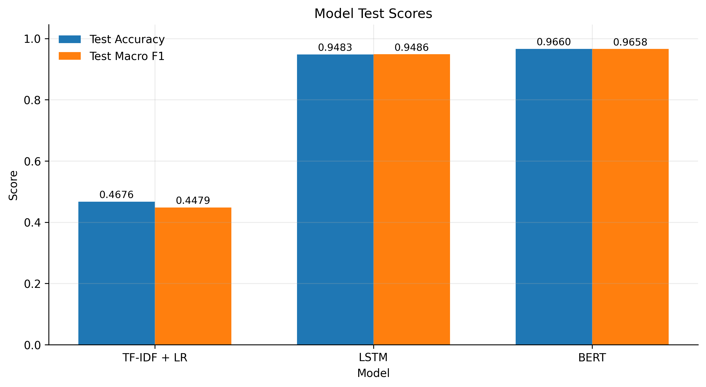
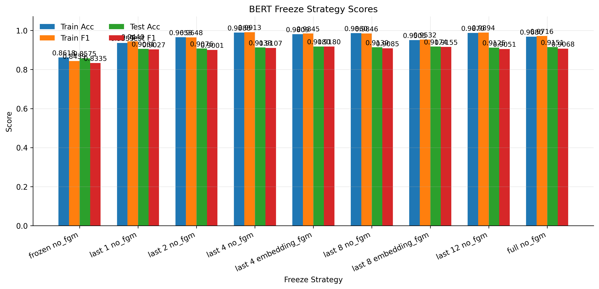
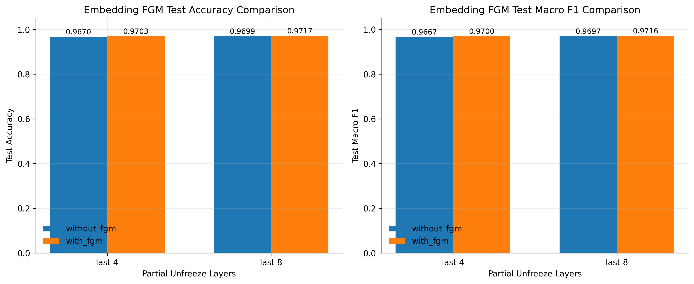
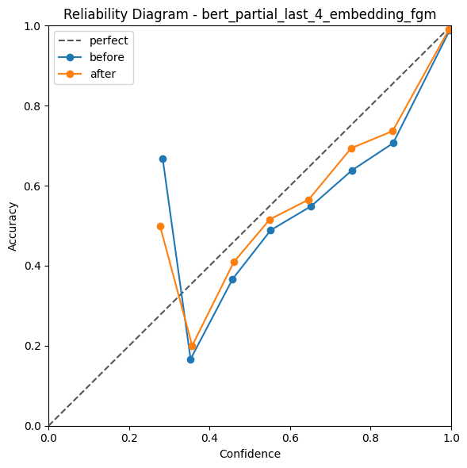

# 中文新闻文本分类实验结果对比

本项目使用 CNews 中文新闻数据集做文本分类实验。实验中主要比较了三类模型：`TF-IDF + Logistic Regression`、`LSTM` 和 `BERT`。在 BERT 部分，又进一步比较了不同微调策略、是否加入 FGM 对抗训练，以及温度校准前后的置信度表现。

本 README 只保留实验结果和分析，不再放具体操作细则。详细运行步骤见 `docs/OPERATION.md`。

## 1. 不同模型结果对比

首先比较三个主要模型在测试集上的表现。

| 模型 | 实验目录 | Test Accuracy | Test Macro F1 | Test Loss | 说明 |
| --- | --- | ---: | ---: | ---: | --- |
| TF-IDF + LR | `lr_tfidf` | 0.4676 | 0.4479 | - | 传统机器学习 baseline，效果最低 |
| LSTM | `lstm` | 0.9483 | 0.9486 | 0.2276 | 相比 LR 提升明显 |
| BERT | `bert_partial_last_8_no_fgm` | 0.9699 | 0.9697 | 0.1162 | 效果最好，说明预训练模型优势明显 |

从结果看，三个模型的效果差距比较明显：

- `TF-IDF + LR` 的 Macro F1 只有 `0.4479`，说明单纯依靠词频特征和线性分类器不太够，后续需要进一步检查max_features、ngram_range、类别映射与数据预处理流程。
- `LSTM` 的 Macro F1 达到 `0.9486`，比 LR 高很多，说明深度学习模型能学到更多文本顺序和语义信息。
- `BERT` 的 Macro F1 达到 `0.9697`，是三个模型中最好的。

对应图表：

- `outputs/comparison/model_test_scores.png`
- `outputs/comparison/model_metric_heatmap.png`
- `outputs/comparison/model_test_loss.png`

## 2. 同一 BERT 模型的微调策略对比

这里比较的是同一个 BERT 模型，在不同冻结/解冻策略下的表现。主要区别是哪些参数参与训练。

| 策略 | 实验目录 | 可训练参数比例 | Test Accuracy | Test Macro F1 | Test Loss |
| --- | --- | ---: | ---: | ---: | ---: |
| frozen | `bert_frozen` | 0.0075% | 0.9406 | 0.9398 | 0.1854 |
| full | `bert_full_no_fgm` | 100.0000% | 0.9567 | 0.9564 | 0.1461 |
| partial last 1 | `bert_partial_last_1` | 7.5152% | 0.9654 | 0.9652 | 0.1176 |
| partial last 2 | `bert_partial_last_2` | 14.4453% | 0.9662 | 0.9658 | 0.1132 |
| partial last 4 | `bert_partial_last_4_no_fgm` | 28.3057% | 0.9670 | 0.9667 | 0.1122 |
| partial last 8 | `bert_partial_last_8_no_fgm` | 56.0265% | 0.9699 | 0.9697 | 0.1162 |
| partial last 12 | `bert_partial_last_12` | 83.7472% | 0.9677 | 0.9675 | 0.1175 |

可以看出：

- `frozen` 只训练分类头，参数量最少，但效果也最低。
- `full` 训练所有参数，但这次结果没有超过 partial 策略；可以说明全参数微调不一定带来最好的效果，Partial finetune_strategy能够再保留底层语义的同时，调整高层以适应高层新闻分类任务。
- `partial last 8` 在不加 FGM 的情况下表现最好，Test Macro F1 为 `0.9697`。
- 解冻层数不是越多越好，`last 12` 比 `last 8` 略低。
- 解冻层数过少可能因为可训练参数过少而导致任务匹配性不足；但如果解冻层数过多可能会导致训练成本和过拟合风险过高。因此partial 8在训练参数中取得了比较好的平衡。

对应图表：

- `outputs/bert_freeze/bert_freeze_scores.png`
- `outputs/bert_freeze/bert_freeze_trainable_params.png`
- `outputs/bert_freeze/bert_freeze_efficiency.png`

## 3. 同一 BERT 模型有无 FGM 模块对比

这一部分只比较 partial last 4 和 partial last 8，因为 FGM 目前只在这两组实验中使用。
由于标准 FGM 通常作用于 BERT 的 word embedding 层，而 Partial Fine-tuning 默认可能冻结 embedding，因此本项目中的 `embedding_fgm` 表示在对应 partial 策略下额外允许 word embedding 参与对抗扰动训练。

| 解冻层数 | 无 FGM 实验 | 有 FGM 实验 | 无 FGM Accuracy | 有 FGM Accuracy | Accuracy 提升 | 无 FGM Macro F1 | 有 FGM Macro F1 | Macro F1 提升 |
| ---: | --- | --- | ---: | ---: | ---: | ---: | ---: | ---: |
| last 4 | `bert_partial_last_4_no_fgm` | `bert_partial_last_4_embedding_fgm` | 0.9670 | 0.9703 | +0.0033 | 0.9667 | 0.9700 | +0.0033 |
| last 8 | `bert_partial_last_8_no_fgm` | `bert_partial_last_8_embedding_fgm` | 0.9699 | 0.9717 | +0.0018 | 0.9697 | 0.9716 | +0.0019 |

从表中可以看到：

- `last 4` 加入 FGM 后，Macro F1 从 `0.9667` 提升到 `0.9700`。
- `last 8` 加入 FGM 后，Macro F1 从 `0.9697` 提升到 `0.9716`。
- 两组实验中 FGM 都带来了提升，但提升幅度不算特别大。
- `bert_partial_last_8_embedding_fgm` 是 FGM 对比中测试 Macro F1 最高的一组。

对应图表：

- `outputs/fgm_comparison/bert_fgm_comparison.png`
- `outputs/fgm_comparison/bert_fgm_gain.png`

## 4. 置信度与温度校准展示

置信度展示使用的是实验 `bert_partial_last_4_embedding_fgm`。这里比较校准前和校准后的模型置信度情况。
Temperature Scaling 的目标不是提升分类准确率，而是改善 softmax 概率的可靠性。因此 Accuracy 和 Macro F1 基本不变是正常现象，重点应观察 ECE 和 NLL 是否下降。

| 指标 | 校准前 | 校准后 | 变化 |
| --- | ---: | ---: | ---: |
| Accuracy | 0.9703 | 0.9703 | 0.0000 |
| NLL | 0.1013 | 0.0957 | -0.0057 |
| ECE | 0.0127 | 0.0081 | -0.0046 |
| Temperature | - | 1.1642 | - |

说明：

- 温度校准不会改变预测类别，所以 Accuracy 没有变化。
- NLL 从 `0.1013` 降到 `0.0957`，说明概率分布更合理。
- ECE 从 `0.0127` 降到 `0.0081`，说明置信度和真实准确率更接近。
- temperature 为 `1.1642`，表示模型原来的 logits 被适当缩放，预测置信度变得没有那么尖锐。

校准图：

## 5. 置信度分箱结果

下面展示 `bert_partial_last_4_embedding_fgm` 在测试集上的置信度分箱。这里选取非空分箱，主要看每个置信度区间里的平均置信度和实际准确率是否接近。

### 校准前

| 置信度区间 | 样本数 | 实际准确率 | 平均置信度 | 差距 |
| --- | ---: | ---: | ---: | ---: |
| 0.20-0.30 | 3 | 0.6667 | 0.2836 | 0.3831 |
| 0.30-0.40 | 12 | 0.1667 | 0.3527 | 0.1861 |
| 0.40-0.50 | 30 | 0.3667 | 0.4571 | 0.0905 |
| 0.50-0.60 | 90 | 0.4889 | 0.5519 | 0.0630 |
| 0.60-0.70 | 82 | 0.5488 | 0.6522 | 0.1035 |
| 0.70-0.80 | 94 | 0.6383 | 0.7535 | 0.1152 |
| 0.80-0.90 | 160 | 0.7063 | 0.8557 | 0.1495 |
| 0.90-1.00 | 9529 | 0.9892 | 0.9968 | 0.0076 |

### 校准后

| 置信度区间 | 样本数 | 实际准确率 | 平均置信度 | 差距 |
| --- | ---: | ---: | ---: | ---: |
| 0.20-0.30 | 6 | 0.5000 | 0.2767 | 0.2233 |
| 0.30-0.40 | 15 | 0.2000 | 0.3567 | 0.1567 |
| 0.40-0.50 | 44 | 0.4091 | 0.4601 | 0.0510 |
| 0.50-0.60 | 95 | 0.5158 | 0.5496 | 0.0338 |
| 0.60-0.70 | 92 | 0.5652 | 0.6461 | 0.0808 |
| 0.70-0.80 | 124 | 0.6935 | 0.7515 | 0.0579 |
| 0.80-0.90 | 186 | 0.7366 | 0.8547 | 0.1181 |
| 0.90-1.00 | 9438 | 0.9912 | 0.9949 | 0.0037 |

可以看到，高置信度区间 `0.90-1.00` 的样本最多。校准前平均置信度是 `0.9968`，实际准确率是 `0.9892`；校准后平均置信度变成 `0.9949`，实际准确率是 `0.9912`，二者更接近。

## 6. 总结

综合来看：

- 不同模型之间，BERT 效果最好，LSTM 次之，TF-IDF + LR 最低。
- 同一个 BERT 模型中，partial fine-tuning 比 frozen 更好，其中 `partial last 8` 表现比较稳定。
- 加入 FGM 后，partial last 4 和 partial last 8 都有小幅提升。
- 温度校准不提升分类准确率，但能改善模型置信度，让预测概率更可信。

## 7. 补充

- 具体项目结构存储在`docs/`下的`PROJECT_STRUCTURE.md`文件里
- 操作细则以及各项运行细节存储在`docs/`下的`OPERATION.md`文件里